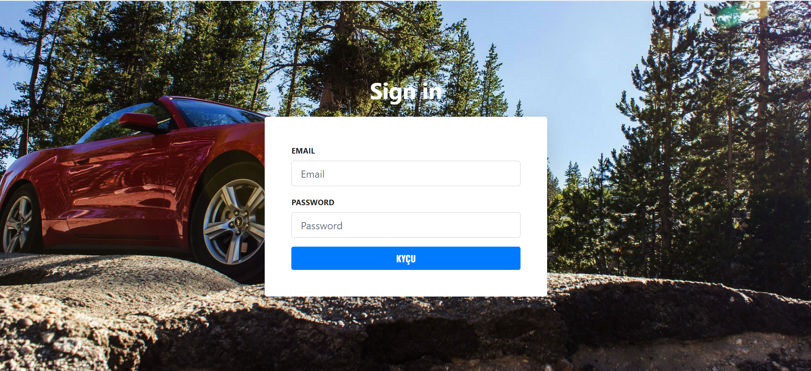
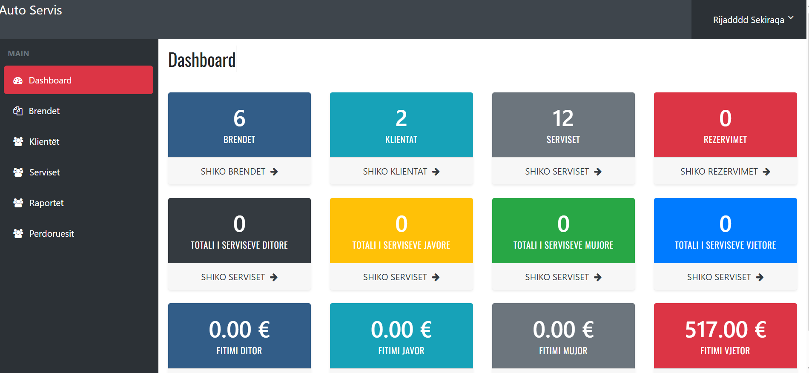

# 🚗 Auto-Garage - Sistem për menaxhimin e Auto-Serviseve

**Auto-Garage** është një Web App i zhvilluar me **Laravel 12**, **Livewire 3.6** dhe **Bootstrap 4** për menaxhimin efikas të një **auto-garazhi (auto-servisi)**.  
Sistemi ofron mundësi për regjistrimin e klientëve, veturave, serviseve dhe përfshin raporte, statistika dhe kontroll të plotë me role dhe leje (permissions).

---

## ⚙️ Teknologjitë e përdorura

- 🧱 **Laravel 12** – Framework për backend
- ⚡ **Livewire 3.6** – Komponente dinamike pa JavaScript shtesë
- 🎨 **Bootstrap 4** – Për ndërtimin e frontend-it
- 🗄️ **MySQL** – Si databazë
- 🔐 **Spatie Laravel Permission** – Menaxhimi i roleve dhe lejeve të përdoruesve
- 🧩 **Blade Components** – Për strukturë të qartë dhe të mirë-organizuar të view-ve

---

## 🚀 Funksionalitetet kryesore

### 🔧 Menaxhimi i të dhënave (CRUD)
- **Brendet** – regjistrimi i markave të veturave (p.sh. Audi, BMW, Mercedes, etj.)
- **Klientët** – ruajtja e të dhënave të klientëve
- **Veturat** – lidhja e veturave me klientët përkatës
- **Serviset** – regjistrimi i shërbimeve të kryera për çdo veturë

### 🧾 Regjistrimi i servisit
- Zgjedh **klientin** nga dropdown
- Në bazë të klientit, shfaqen **veturat përkatëse**
- Plotësohen të dhënat e servisit:
  - Problemi i veturës
  - Riparimet e kryera
  - Çmimi për secilën pjesë ose punë
  - Totali automatik dhe **zbritja (nëse aplikohet)**
  - Shuma përfundimtare
  - Data e servisit
  - Kilometrat e veturës
  - Mekaniku përgjegjës

### 📊 Raporte & Filtrime
- Filtrimi i serviseve sipas **klientit** dhe **veturave te klientit**
- Fakturat e serviseve sipas klientit dhe vetures se tij te perzgjedhur
- Raporte të qarta në formë tabele

### 📈 Dashboard Statistikor
Dashboard-i përmban **cards** me statistika të ndryshme si:
- Numri i **Brendeve**
- Numri i **Klientëve**
- Numri i **Serviseve**
- Numri i **Rezervimeve**
- Totali i Serviseve:
  - Ditore  
  - Javore  
  - Mujore  
  - Vjetore  
- Fitimi:
  - Ditor  
  - Javor  
  - Mujor  
  - Vjetor  

### 🔐 Menaxhimi i përdoruesve
- Autentifikim i sigurt përmes **Laravel Auth**
- **Role & Permissions** të menaxhuara përmes **Spatie Laravel Permission**
- Kontroll i aksesit për module të ndryshme bazuar në rolin e përdoruesit (Admin,Staf)

## 📸 Screenshots

### Login Page

### Dashboard

